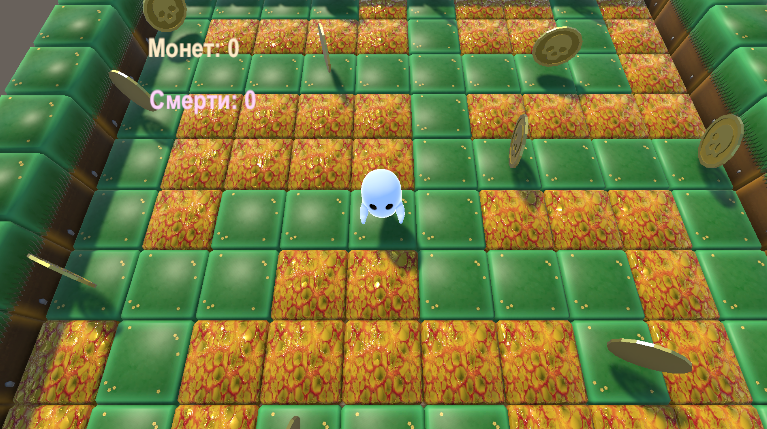
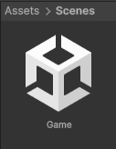

# Ghost-of-Lesha

Учебный проект на Unity, использована версия 6000.3.9f1

## Как скачать и запустить

Клонируйте репозиторий с помощью git или просто скачайте zip-архив.
Для получения файлов проекта выберите один из способов: 
- используйте команду `git clone <URL>` в терминале
- либо нажмите кнопку "Code" и выберите "Download ZIP" на странице репозитория

Откройте проект в **Unity**. В окне **Project** найдите сцену **Game** и откройте её двойным щелчком.
Нажмите кнопку **Play** для запуска.

Проект распространяется под лицензией MIT - подробности в файле [LICENSE](LICENSE).

This project is licensed under the MIT License - see the [LICENSE](LICENSE) file for details.

